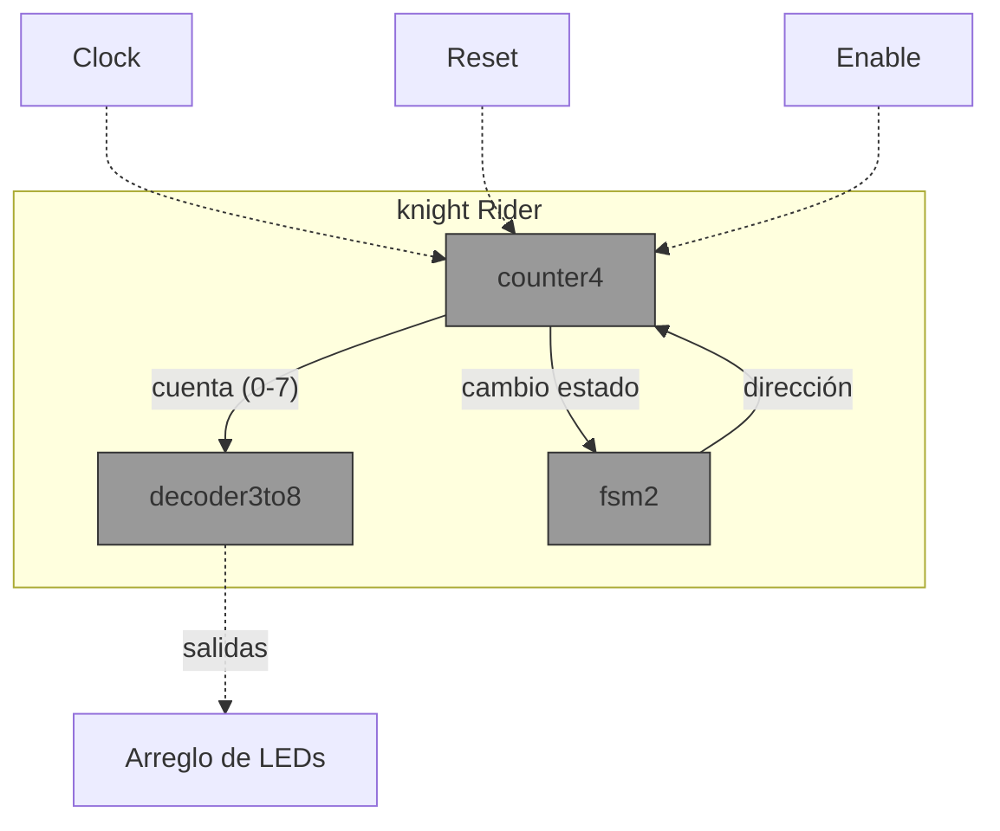

# Proyecto Verilog – Knight Rider
## 1. Descripción General
Este proyecto implementa en Verilog una arquitectura compuesta por cuatro módulos principales, orientados a emular la clásica secuencia de luces tipo *Knight Rider*.  

## Descripción de los Módulos

### 🔹 1. decoder3to8
- **Tipo**: Combinacional.  
- **Función**: Activa una sola de sus 8 salidas dependiendo del valor de la entrada de 3 bits.  
- **Entradas**: `sel[2:0]` (selector).  
- **Salidas**: `out[7:0]` (líneas decodificadas, una activa).  
- **Uso en el sistema**: Determina qué LED está encendido en cada momento de la secuencia.

---

### 🔹 2. counter4
- **Tipo**: Secuencial.  
- **Función**: Contador ascendente/descendente de 4 bits con reset asíncrono y habilitación.  
- **Entradas**:  
  - `clk`: señal de reloj.  
  - `reset`: reinicio asíncrono.  
  - `enable`: habilitación de conteo.  
  - `dir`: dirección (0 = ascendente, 1 = descendente).  
- **Salidas**: `count[3:0]` (valor actual del contador).  
- **Uso en el sistema**: Genera la posición que se pasa al decodificador para encender un LED específico.

---

### 🔹 3. fsm2
- **Tipo**: Secuencial (máquina de estados finitos).  
- **Función**: Controla el sentido de la secuencia (izquierda/derecha).  
- **Estados**:  
  - `S0`: dirección ascendente.  
  - `S1`: dirección descendente.  
- **Entradas**: `clk`, `reset`.  
- **Salidas**: `dir` (bit que controla al contador).  
- **Uso en el sistema**: Permite el efecto de "rebote" al llegar al LED final, cambiando el sentido de la secuencia.

---

### 🔹 4. knight_rider (módulo superior)
- **Tipo**: Estructural.  
- **Función**: Integra el decodificador, el contador y la FSM de dos estados para generar la secuencia completa de tipo *Knight Rider*.  
- **Entradas**: `clk`, `reset`, `enable`.  
- **Salidas**: `leds[7:0]` (secuencia luminosa).  
- **Uso en el sistema**: Coordina el funcionamiento de los otros tres módulos y genera la salida visible en los LEDs.

Cada módulo cuenta con su respectivo banco de pruebas.

---
## 2. Diagrama de Bloques (Mermaid)

---
## 3. Estrategia de Prompts e Iteraciones

Durante el desarrollo del proyecto, se usaron prompts en un flujo iterativo para mejorar la robustez del sistema:

- **Prompt inicial**: Solicité el diseño general del sistema con los módulos especificados.  
- **Prompt de refinamiento**: Pedí explicaciones detalladas de cada módulo y sus bancos de pruebas.  
- **Prompt de integración**: Solicité el módulo superior que conecta todos los componentes.  
- **Prompt de robustez**: Definí un conjunto de preguntas críticas para garantizar que el sistema sea sólido ante diferentes escenarios.  

---

## 4. Preguntas de Robustez 

### 🔹 1. ¿Cómo asegurar que el decodificador no presente condiciones indeseadas (glitches) en las salidas al cambiar el selector?  
Se recomienda sincronizar la señal de entrada con flip-flops y aplicar lógica combinacional simple (sin cascadas profundas). Además, en simulación se pueden usar retardos unitarios para verificar posibles transiciones espurias.

### 🔹 2. ¿Qué pasaría si en el contador ocurre un overflow o underflow? ¿Cómo garantizar que no active posiciones inválidas en el decodificador?  
El contador debe limitarse al rango válido (0–7). Se recomienda usar comparaciones explícitas en la lógica de incremento/decremento y aplicar saturación o reinicio al alcanzar los límites.

### 🔹 3. ¿Qué modificaciones se podrían hacer para que la FSM de dos estados sea sincrónica y con reset determinista?  
Incluir un `always @(posedge clk or posedge reset)` con un estado inicial definido explícitamente (ej. estado = 0 al reset). Esto asegura comportamiento determinista y evita estados indeseados.

### 🔹 4. ¿Cómo puedo agregar un control de velocidad (divisor de frecuencia) para que la secuencia no sea demasiado rápida en hardware real?  
Añadiendo un **divisor de frecuencia** basado en un contador adicional. Este módulo genera un pulso de habilitación cada cierto número de ciclos, controlando así la velocidad percibida de la secuencia.

### 🔹 5. ¿Cómo puedo diseñar un banco de pruebas aleatorio para estresar el sistema?  
Se puede usar generación de estímulos pseudoaleatorios en Verilog con `$random`, aplicando variaciones de `reset`, `enable` y `clk`. Esto permite observar comportamiento bajo condiciones inesperadas y verificar la robustez.

### 🔹 6. ¿Cómo evitar rebotes de señal si el reset o enable vienen de un botón físico?  
Implementando **debouncing** digital: usar un filtro basado en un contador o un flip-flop sincronizado para estabilizar la señal antes de aplicarla al sistema principal.

### 🔹 7. ¿Cómo se puede extender este diseño para que el jinete caballeroso funcione en un arreglo de LEDs de más de 8 posiciones (ejemplo: 16 o 32)?  
Ampliando el decodificador (por ejemplo, 4 a 16 o 5 a 32), y ajustando el contador a más bits. La FSM de dos estados se mantiene igual, ya que solo gestiona la dirección del barrido.

---

## 4. Estrategia de Pruebas

- **Pruebas unitarias**: Cada módulo fue simulado individualmente para verificar su comportamiento esperado.  
- **Pruebas de integración**: El módulo superior se probó conectando los demás en una simulación completa.  
- **Pruebas de robustez**: Se aplicaron escenarios de overflow, underflow, rebotes y estímulos aleatorios para validar la solidez del diseño.  

---

## 5. Uso de IA en el Proyecto

Para apoyar la escritura del código y la documentación, se utilizó **ChatGPT (modelo GPT-5)**.  
Se trabajó con prompts iterativos (inicial, refinamiento, integración y robustez).  
El conjunto de preguntas de robustez fue definido como parte de la estrategia de diseño, y luego respondido de manera dirigida para documentar buenas prácticas.  
